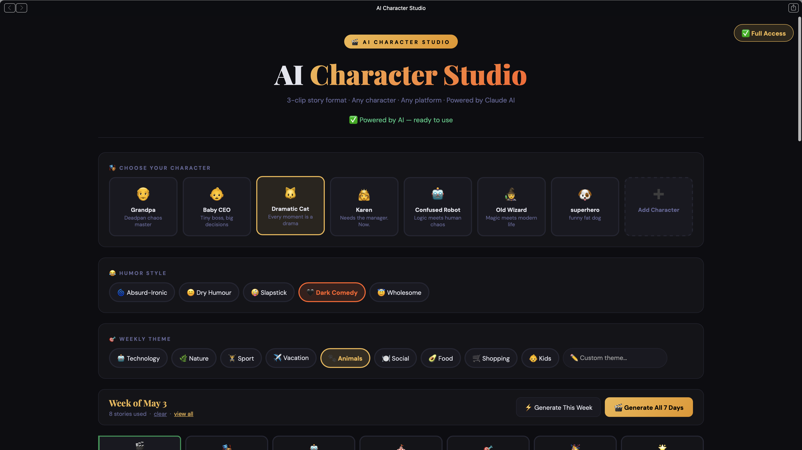
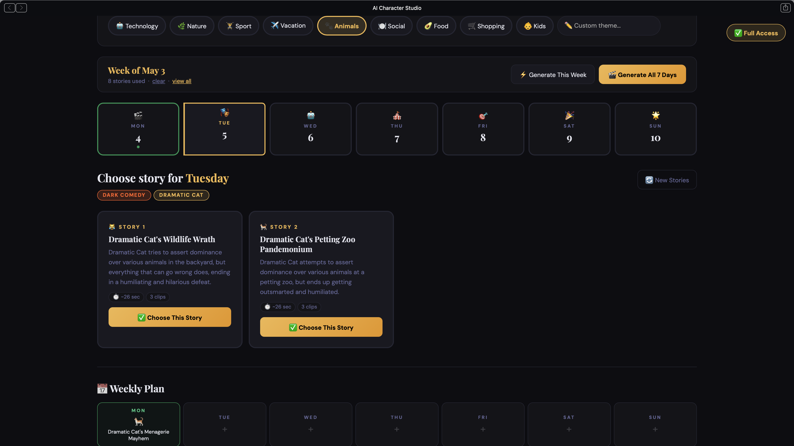
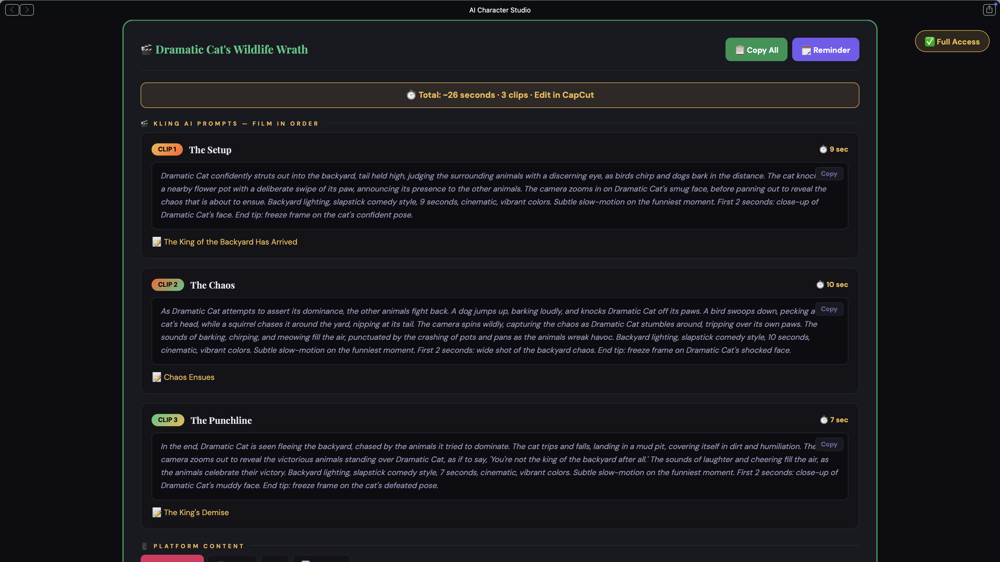

# 🎬 AI Character Studio

**Generate complete 3-clip viral video stories for any character — powered by AI.**

Turn any character into a consistent short-form content machine. Pick a character, humor style, and weekly theme, then get ready-to-use **Kling AI prompts + captions** perfect for TikTok, Instagram Reels, YouTube Shorts, and X.

🔗 **Live Demo**: [ai-character-studio.netlify.app](https://ai-character-studio.netlify.app)

---

### ✨ Features

- **6 Built-in Characters**: Grandpa, Baby CEO, Dramatic Cat, Karen, Confused Robot, Old Wizard
- **Custom Characters**: Describe any character and generate stories in their unique style
- **3-Clip Viral Formula**: Setup → Chaos → Punchline (~26 seconds total)
- **5 Humor Styles**: Absurd-Ironic, Dry Humour, Slapstick, Dark Comedy, Wholesome
- **9 Weekly Themes**: Technology, Nature, Sport, Vacation, Animals, Social, Food, Shopping, Kids
- **Ready-to-post content**: Kling AI prompts, catchy captions, hashtags, sound suggestions & polls
- **Mac Calendar Export**: Download .ics file with your full posting schedule
- **Story History**: Avoids repeating the same situations
- **Paywall**: 3 free stories, password-protected full access

---

### 🚀 How It Works

1. Choose your character
2. Select humor style + weekly theme
3. Click on any day of the week
4. Get 3 complete story packs (each with 3 Kling prompts)
5. Copy prompts → Generate in Kling AI → Edit in CapCut → Post

---

### 📸 Screenshots


*Character & theme selection*


*Weekly planning calendar*


*Generated Kling prompts and captions*

---

### 🛠️ Tech Stack

- **Frontend**: Vanilla HTML + CSS + JavaScript (single file)
- **Backend**: Netlify Functions (Node.js)
- **AI Model**: Groq + Llama 3.3 70B
- **Hosting**: Netlify (free tier)

---

### 💡 Content Strategy

Each story follows the proven **3-clip viral structure**:
- **Clip 1 – The Setup** (8-9s)
- **Clip 2 – The Chaos** (9-10s)
- **Clip 3 – The Punchline** (6-8s)

Total runtime ≈ 26 seconds — ideal for Reels, TikTok, and Shorts.

---

### 🔧 Quick Setup & Deploy

1. Clone the repo
   ```bash
   git clone https://github.com/crisgea71/ai-character-studio.git
   cd ai-character-studio
